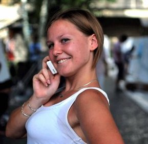

<!DOCTYPE html>
<html lang="en">
    <head>
        <meta charset="UTF-8" />
        <meta http-equiv="X-UA-Compatible" content="IE=edge" />
        <meta name="viewport" content="width=device-width, initial-scale=1.0" />
        <link rel="stylesheet" href="css/style.css" />
        <title>Anna Lavrinchuk CV-</title>
    </head>
    <body>
        

            <header class="main container__main container__flex">
                <address class="address main__address">
                    <h1 class="title title_main address__title">
                        Anna Lavrinchuk
                    </h1>
                    

                        Date of birth: 13 may 1988
                    

                    <a
                        href="tel:+380663347263"
                        class="text text_address text_link address__text"
                        >Phone: +38 066 334 72 63</a
                    >
                    <a
                        href="mailto:Lavrinchuk@yahoo.com"
                        class="text text_address text_link address__text"
                        >e-mail: Lavrinchuk@yahoo.com</a
                    >
                    
Country: Ukraine

                    

                        
Socials:

                        
                        
                        
                    

                </address>
                
            </header>
            <section class="about-me container__about-me">
                <article class="personal-summary about-me__personal-summary">
                    <h2
                        class="title title_personal-summary personal-summary__title"
                    >
                        Personal Summary
                    </h2>
                    

                        Calm, a pleasant, helpful, and hardworking individual
                        who has a passion for creating a new for my clients. I
                        am trying to pass my experiences to all my clients. I am
                        always trying to do my best. All my client’s dreams
                        should become true. It did not matter how much time it
                        would take or how difficult it will be, I would make
                        everything of my clients. I am always trying to find
                        something interesting for me at work, home. I never
                        stop, I am just going ahead and I would never turn back,
                        no matter how hard it will be me.
                    

                </article>
                <article class="objective about-me__objective">
                    <h2 class="title title_objective objective__title">
                        Objective
                    </h2>
                    

                        Obtain a position in a company that values its employees
                        and encourages their interests in work and development
                        areas.
                    

                </article>
                <article class="experience about-me__experience">
                    <h2 class="title title_experience experience__title">
                        Experience
                    </h2>

                    

                        <time
                            class="text experience__text experience__text_time"
                            >02.01.2020 - till now...</time
                        >
                        
Front-end-Developer

                        <ul
                            class="text experience__text experience__text_description"
                        >
                            <li class="experience__item">
                                HTML/CSS - beginner
                            </li>
                            <li class="experience__item">
                                JS – in progress (Infopulse-Univer)
                            </li>
                            <li class="experience__item">
                                PhotoShop – beginner
                            </li>
                            <li class="experience__item">
                                Bootstrap – beginner
                            </li>
                            <li class="experience__item">Jquery - beginner</li>
                        </ul>
                    

                    

                        <time class="text experience__text"
                            >01.2010 – till now…</time
                        >
                        
Sale manager

                        <ul
                            class="text experience__text experience__text_description"
                        >
                            <li class="experience__item">
                                Service of corporate clients on business and
                                personal trips;
                            </li>
                            <li class="experience__item">
                                Making events all over the world for 10 to 500
                                persons.
                            </li>
                            <li class="experience__item">Customer support</li>
                            <li class="experience__item">
                                Sales a dream (Travel all over the world,
                                cruises, privet jet, privet yachts)
                            </li>
                            <li class="experience__item">
                                Open brunch office in Miami (for Pilot Travel
                                Inc)
                            </li>
                        </ul>
                    

                </article>
                <article class="education about-me__education">
                    <h2 class="title title_education education__title">
                        Education
                    </h2>
                    

                        <time class="text education__text"
                            >09.2010-06.2011</time
                        >
                        
Master

                        

                            Pedagogical University. B.D.Grinchenka, Preschool
                            Education: Teachers Preschool Pedagogy and
                            Psychology at the University.
                        

                    

                    

                        <time class="text education__text"
                            >09.2009-08.2010</time
                        >
                        
Expert

                        

                            Kiev Pedagogical University. B.D.Grinchenka, Early
                            Childhood Education: Teacher trainer, Educational
                            Process Organizer.
                        

                    

                </article>
                <article class="add-education about-me__add-education">
                    <h2 class="title title_add-education add-education__title">
                        Additional education
                    </h2>
                    

                        <time class="text add-education__text"
                            >01.04.2020 - 29.12.2020</time
                        >
                        <ul
                            class="text add-education__text add-education__text_description"
                        >
                            <li class="add-education__item">
                                Front-end in Infopulse Univer
                            </li>
                            <li class="add-education__item">
                                JavaScript in Infopulse Univer
                            </li>
                        </ul>
                    

                </article>
                <article class="certificate about-me__certificate">
                    <h2 class="title title_certificate certificate__title">
                        Certificates
                    </h2>
                    

                        Just in Travel Industry
                    

                </article>
                <article class="language about-me__language">
                    <h2 class="title title_language language__title">
                        Languages
                    </h2>
                    <ul class="text language__text">
                        <li class="language__item">
                            English - A2 (EPAM - testing)
                        </li>
                        <li class="language__item">
                            Ukrainian - native speaker
                        </li>
                        <li class="language__item">Russian - native speaker</li>
                    </ul>
                </article>
            </section>
        

    </body>
</html>